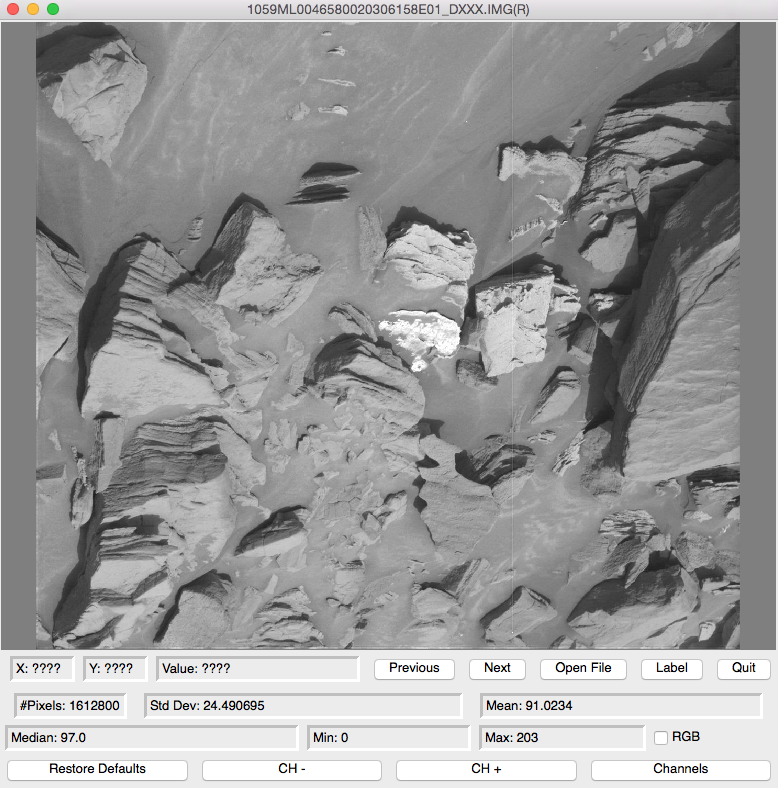
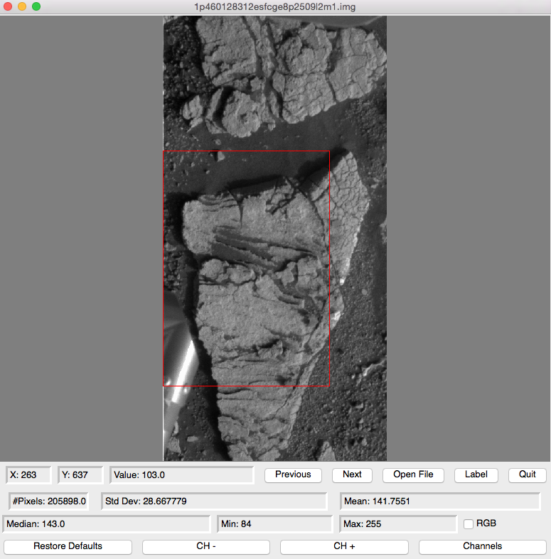
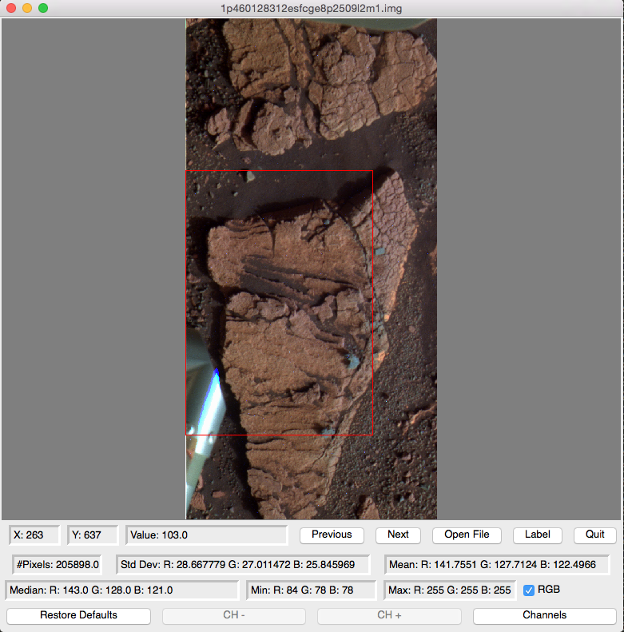
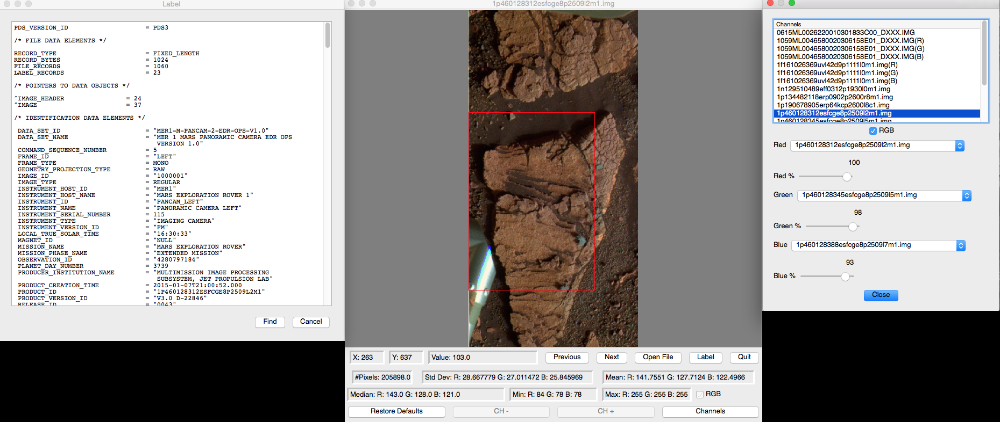

====================================
pdsview - A Python PDS Image Viewer
====================================

.. image:: https://travis-ci.org/planetarypy/pdsview.svg?branch=master
   :target: https://travis-ci.org/planetarypy/pdsview

.. image:: https://img.shields.io/pypi/v/pdsview.svg
        :target: https://pypi.python.org/pypi/pdsview

**NOTE:** This is Alpha quality software that is being actively developed, use
at your own risk.  This software is not produced by NASA.

* Free software: BSD license
* Documentation: https://pdsview.readthedocs.org.

Features
--------

* NASA PDS Image Viewer

**NOTE:** This is alpha quality software.  It lacks many features and lacks
support for many PDS image types.  This software is not produced by NASA.

Install
-------

On OS X you must first install the Qt UI toolkit using Homebrew
(http://brew.sh/).  After installing Homebrew, issue the following command::

    brew install qt

Create a new virtual environment, install the `pdsview` module with pip,
and setup the PySide environment::

    mkvirtualenv pdsview
    pip install pdsview
    pyside_postinstall.py -install

Now you should be able to run the `pdsview` program.

This works on Linux as well (Ubuntu 14.04).  Instructions coming soon.
Installing the proper Qt dev package and running `pyside_postinstall.py`
in a similar fashion should work.

Screen Shots
------------

Default View:

Region of Interest:

Composite False Color Image:

View Label and make alterations to image:

